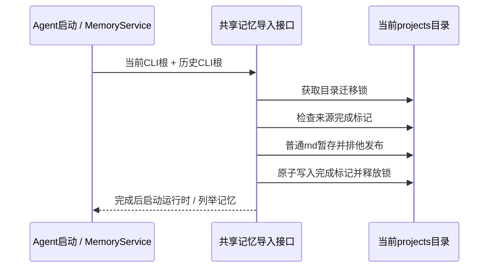

# 项目记忆存储与旧数据兼容

## 产品规则与边界

- 桌面/Host 注入数据基目录时，项目记忆读写统一使用 `<数据基目录>/.zcode/cli/memories/projects/<workspace-key>/memory`；独立 CLI 未注入目录时保留其 `storage.dir` 语义。
- workspace key 的 identity 优先级、路径归一化和 hash 算法不变；不改变 session DB、插件配置或子代理独立记忆的目录。
- 查看页首次列举、Agent 启动前，通过共享 Node 接口导入历史 CLI 项目记忆。来源仅为历史 CLI storage root 和真实用户目录 `.zcode/cli`，不扫描其它产品 profile。
- 仅复制 memory 下普通 Markdown 文件，保留旧文件；目标同名文件优先，不覆盖。符号链接不可用于跨目录读取或写入。
- 迁移完成记录每个来源的持久化标记。下次启动或列举先检查标记，命中后不访问旧目录、不建目录、不获取迁移锁。锁内再次确认标记，防止两个首次迁移并发。后续删除导入的记忆不会重新出现；源目录不存在时不记录完成，允许后来恢复备份。导入失败透传错误并允许重试。
- 设置页仍保留 `.zcode/v2` 作为应用设置/会话数据目录；记忆是同一数据根下的兄弟目录，不搬进 v2。显示实际生效的基目录，保存选择的绝对目录。
- 更换数据基目录时，同时复制项目记忆及迁移标记；旧目录保留，目标文件优先。不迁移配置、凭据或其它 CLI 数据。

## 所有者、接口与事件顺序

共享 `@zcode/shared/node` 提供项目记忆 CLI 根解析及幂等导入。Agent bootstrap 与 MemoryService 调用同一导入接口；目标 projects 目录的文件锁串行化多个进程的导入，来源路径 hash 是幂等 key。文件先在目标目录暂存，再排他发布，最后原子记录完成。完成前不启动 Agent，查看页不返回半成品 catalog。设置切换目录使用同一个锁复制当前快照及来源标记，允许再次切换/重试时复制新文件；源与目标目录重叠时拒绝。不同来源对同一目标也使用同一个锁。

桌面与手机复用 Host 的 MemoryService，迁移仅作用于当前 Host 的本地存储；不引入新的同步流或远程身份转换。

## 验收

- Local profile / 自定义数据根下，Agent memory root 与查看页 root 相同；独立 CLI 的自定义 storage 保持有效。
- 真实旧目录中的文件可以被新目录查看页读取；目标同名内容和旧原件均保留；并发导入幂等，删除后不复活。
- 缺失来源可稍后重试；链接不能导入，写入失败不落完成标记，修复后可重试。
- 更换数据目录后，记忆、应用数据和迁移标记一起保留。
- 设置页描述明确 v2 与记忆目录，展示 Host 提供的生效基目录并保存选择值；保存状态变化不覆盖再次浏览的草稿。

## 验证结果

- 相关记忆、视觉 runtime、恢复及插件测试共 30 项通过，设置目录与视觉设置浏览器 E2E 共 2 项通过。
- 根 `pnpm typecheck`、`pnpm lint`（69 个既有 warnings、0 errors）、改动格式和架构检查通过；bootstrap 及其依赖的 17 项构建/类型检查通过。
- CLI 全量 typecheck 被既有 debug 包缺少 `@zcode/shared/node` 依赖阻塞；CLI 全量 lint 被既有 max-lines 等错误阻塞。改动 CLI 文件与 HEAD 对比为 6 个既有诊断、0 个新增诊断。
- 本机 macOS 使用系统 Chrome 验证，未调用真实供应商模型，未生成完整 Electron 安装包；其它平台仍需构建验证。
