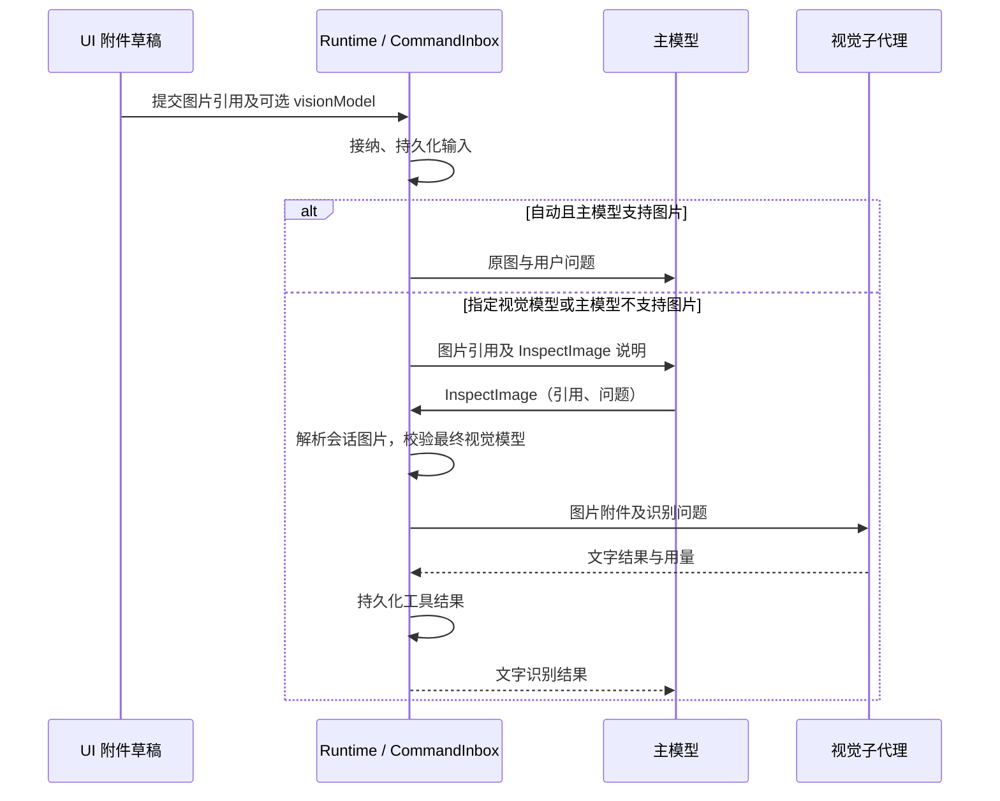
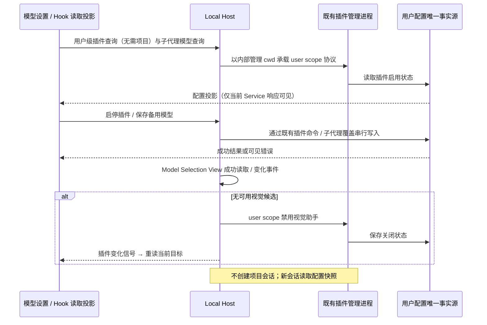

# 视觉助手

## 产品规则

- 优先级为：用户为本次图片指定的模型 > 主模型原生视觉 > 备用视觉模型。
- 默认自动路由。支持图片的主模型直接接收图片；仅在主模型不支持图片时使用视觉助手。
- 设置页中的视觉模型是备用模型，配置它不会覆盖主模型的原生视觉。
- 图片附件可以选择本次识图模型；这个选择不改变主会话模型，不影响后续新图片。
- 视觉助手作为随应用离线分发的内置插件，可在模型设置和已安装插件中启停。
- 备用模型复用插件视觉子代理的模型配置，不另存第二份模型选择或凭据。
- 模型设置中的视觉助手属于本机用户级全局配置，与 Provider 配置读取同一 Local Host；没有打开项目、当前仅打开远程项目或远程断连时，仍可读取和修改，不依赖模型连通性测试的 cwd。
- 用户级插件读取与启停允许不传工作区；Host 复用已有插件管理进程及内部 cwd 补全协议载体，强制 user scope，不新建会话或伪造 UI 工作区。workspace scope 仍要求真实工作区，并保留远程 identity 路由。
- 配置 UI 区分正在加载、读取错误、远程等待与插件未安装；提供显式重试，不能把这些情况统一显示为“请打开工作区”。Hook 只持有目标 Service 的读取投影，目标切换后拒绝旧响应。
- 视觉候选只来自当前 Host 的 Model Selection View（用户已配置、启用且可执行的模型），再筛选 supportsImage=true；不展示模型模板或未配置的目录候选。新增、删除、停用和能力修改由现有模型变化事件实时更新。
- Host 在初次模型读取成功后和模型变化后检查候选：没有可选视觉模型时，通过原插件启停命令持久化关闭用户级视觉助手，并通知 UI。模型读取失败或尚未完成不能被当成零候选。后来新增模型不自动重新启用；无候选时禁止手动开启。已选择的备用模型被删除但仍有其他候选时保留失效选择提示，不能静默替换。
- 插件启停变化只广播失效信号，UI 重读当前目标配置；模型与插件共享原有事实源，无第二份模型列表或启用状态。Host 销毁先取消订阅并拒绝尚未开始的关闭操作；旧 revision 与 superseded 模型结果不能覆盖新状态。
- 沿用插件和子代理的 runtime 启动快照边界：启停与备用模型的变更对新会话生效，不改写已驻留会话；UI 明确说明。本次图片模型选择随输入提交，在当前会话立即生效。
- 插件关闭时主模型原生视觉继续工作；需要辅助识图时明确提示配置或启用。
- 新提交且显式指定模型的图片在工具不可用时拒绝执行；历史图片改为不可用文字引用，不能阻断后续纯文本请求，也不能静默交给主模型。
- 用户指定的模型不存在、不支持图片或调用失败时明确报告，禁止静默换回主模型。
- 首版覆盖上传、粘贴和本地文件图片。CUA 坐标帧仍遵守现有栅格与坐标凭证守卫，不将文字识图结果当作可操作帧。

## 状态与所有者

| 状态                 | 唯一所有者                                        | 读取与写入路径                                                             |
| -------------------- | ------------------------------------------------- | -------------------------------------------------------------------------- |
| 插件启用状态         | 当前目标 Host 的插件配置                          | 现有 PluginManagementService                                               |
| 备用模型             | 插件视觉子代理的持久化模型覆盖                    | SubagentsService.getPluginAgentModelOverride / setPluginAgentModelOverride |
| 本次图片选择         | 提交前为 composer 附件草稿；提交后为 runtime 输入 | AttachmentRef 中的可选 visionModel                                         |
| 原图与识别结果       | Agent 会话与 artifact 存储                        | 现有附件、子代理、工具事件和持久化链路                                     |
| 请求取消、顺序与恢复 | Agent runtime                                     | 现有 CommandInbox、trace 和 tool/subagent 生命周期                         |

UI 只提交意图。是否直接投递图片由 runtime 根据执行模型能力与已提交的图片选择决定。
图片原始内容保留在会话中；发给无视觉或显式使用其他识图模型的主模型请求仅含图片引用与工具说明。
识图引用从会话原始内容派生，不建立独立图片数据库或第二条任务队列。

## 接口与边界

- SubagentsService 提供只读 getPluginAgentModelOverride，从同一持久化覆盖读取模型，不依赖插件是否启用；设置页关闭插件后仍保留可见配置。
- 内置插件 `vision-assistant@zcode-plugins-official` 提供 `vision-assistant:vision-reader` 子代理。
- `InspectImage` 接受当前会话图片引用或本地图片文件路径，以及识别问题，返回文字识别结果和现有子代理用量信息。
- 上传附件的 `visionModel` 为已有严格校验的 ModelSelection，缺省表示自动路由。
- 引用解析优先使用会话图片的 durable artifact URI / source path / 图片内容及用户模型选择的确定性引用；指定模型只能来自已提交的用户选择，不能由模型伪造覆盖。
- 视觉子代理可以接收图片附件，必须在首轮请求前验证最终执行模型支持图片。
- 子代理启动事件显示本次执行的模型覆盖，不能把用户指定模型显示为配置中的备用模型。
- 对已指定模型的图片，主模型改用 Read 读取同一路径时仍保留用户选择，不能绕过逐图路由；工具媒体持久化也保留该选择。
- 冷恢复保留原始本地路径作为快照别名，provider 的当前路径仍从 artifact 派生。InspectImage 通过别名读取已接纳快照；Read 读取原始路径时校验原始内容 hash，文件已改变则明确要求重新附加，不沿用旧选择或静默回退。
- 工具图片的识图引用在持久化时随媒体元数据保存，恢复后不能因 path 变为 artifact URI 而改变已有引用；不建立第二个引用注册表。
- 文件读取复用 FileSystemPort、现有路径权限和 ImageProcessorPort；模型请求复用现有 modelFactory、Provider Registry 和 adapter。
- 同一图片的不同识别问题可以再次调用工具。工具结果按原 toolCallId 持久化和恢复，不做跨问题缓存。
- 接口变更同步维护 shared V4 AttachmentRef 和 CLI contracts；新增字段可选，历史数据保持自动路由。
- 保持 workspaceIdentity 隔离、remoteSessionId 路由、owner/lease 和 stale-run 防护。

Desktop 使用 desktop-continuous 的实时事件，手机使用 web-remote-replayable 的快照与补洞；二者共享同一 runtime、序列与工具事实。
中止父任务必须取消识图请求；晚到结果继续由现有 generation/branch 守卫丢弃。恢复时读取已保存的结果，不重新识图。

## 验收场景

1. 主模型支持图片、备用模型已配置：自动模式投递原图，视觉助手不发起请求。
2. 主模型不支持图片：主模型收到可解析的图片引用，调用 InspectImage 后获得备用视觉模型的文字结果。
3. 主模型支持图片，用户为图片指定另一个视觉模型：原图只交给指定模型，主模型获得识别结果，主会话模型不变。
4. 同一消息有多张图片：各自选择互不覆盖；默认路由图片仍遵循主模型能力。
5. 插件关闭：原生视觉正常；辅助识图明确报告插件不可用。
6. 未配置备用模型、指定模型被删除或不支持图片：明确失败，不静默替换或无限委派。
7. 上传图片 / 本地图片 / 远程 artifact：解析同一目标 workspace 的图片，不把浏览器文件名当成远端路径。
8. 停止、重连与历史恢复：取消信号传到视觉子代理，模型选择与工具结果保留，重复接纳不重复运行。
9. 设置界面选择项只包含支持图片的模型；模型设置和插件配置读写同一份模型覆盖。
10. 图片附件本次选择可切回自动；发送后清除相应草稿，撤回队列输入时恢复图片选择。
11. 指定图片已识别、关闭插件并重启后恢复：纯文本追问仍可执行，历史原图不会静默投递给主模型。
12. 原始路径经冷恢复仍指向同一图片选择；Read 对未修改文件保留选择，对已修改文件明确失败；工具图片引用经持久化和恢复保持稳定。
13. 无项目和仅有远程项目时，模型设置可启停视觉助手并保存备用模型；切换项目不改变本机全局配置，不调用远端 Host。读取失败可见且可手动重试，未安装显示真实原因。
14. 新增视觉模型立即出现在候选；删除或停用后立即移除。最后一个候选被移除时，关闭设置页也会持久化关闭助手；重新添加模型不会自动开启。初始化错误、旧 revision 和 Host 销毁不能触发错误关闭。

## 验证计划

- 使用目标包现有 node:test 风格，覆盖路由优先级、图片引用解析、指定模型传递、能力拒绝与取消。
- 增加浏览器 E2E 场景验证设置启停、视觉模型过滤、附件本次选择与发送数据。
- 执行相关测试、CLI 类型检查、根 pnpm typecheck、pnpm lint、格式和 architecture:check --changed。
- 环境限制和已有失败单独记录，不能将未执行的验证写成通过。

## 本次验证结果

- 全局入口及实时候选修复：8 个 Service 测试与 1 个系统 Chrome E2E 通过，覆盖无项目配置、远端 ServiceProvider 下使用本机全局服务、错误重试、插件缺失、实时新增删除、零候选关闭、重新添加不自动启用、过期 revision、Host 销毁和启用 RPC 中删除模型。
- 本轮根 `pnpm typecheck`、`pnpm lint`（0 errors、69 个既有 warnings）、改动格式与架构检查（0 baseline、0 new）通过。没有真实供应商调用或完整 Electron 启动验证。
- 修复后 15 个运行时、冷恢复、插件装配及真实持久化测试通过；1 个系统 Chrome 浏览器 E2E 通过，覆盖真实设置组件、附件 owner、模型过滤、逐图选择、发送撤回及手机宽度。
- 根 `pnpm typecheck` 通过；contracts、core、bootstrap 的构建与类型检查通过。
- 根 `pnpm lint` 为 0 errors、69 个既有 warnings；改动 CLI 文件与 HEAD 比较为 10 个既有诊断、0 个新增诊断。
- `pnpm architecture:check --changed` 为 0 baseline、0 new；改动文件格式检查与 `git diff --check` 通过。
- CLI 全量类型检查受既有 debug 包缺失 `@zcode/shared/node` 依赖阻塞；全量 lint 受既有 max-lines 等错误阻塞，未报告为通过。
- 浏览器 fixture 仅替换 Host IO；未进行真实供应商付费调用、完整 Electron 启动或真实远程传输验证。
- 二次 review 已修复历史图片阻断后续请求、冷恢复原始路径丢失模型选择、工具图片引用变化和启动事件显示错误模型；没有新增状态 owner、队列或引用注册表。
- 架构涉及 shared、services、ui 和 zcode-cli，本轮修复集中在 CLI contracts/core；接纳、持久化、启动及回传仍遵循现有事件顺序。相对 HEAD 净增约 1,880 行（含功能 spec 和测试）。
